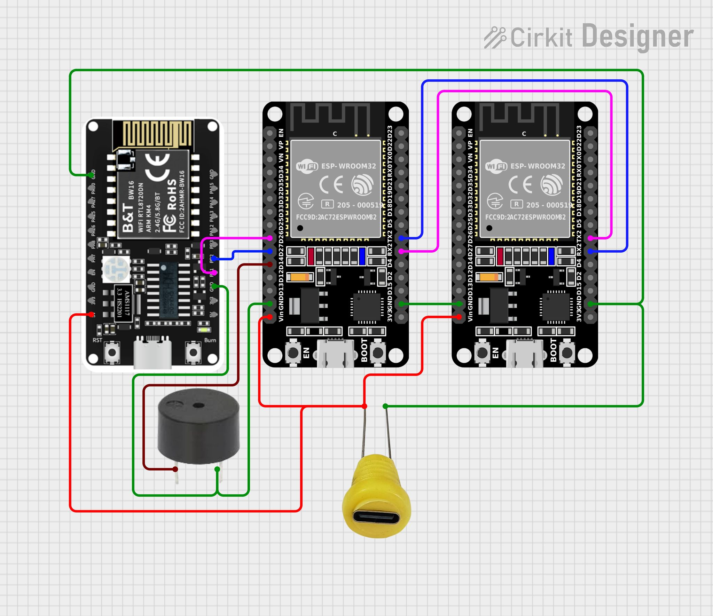
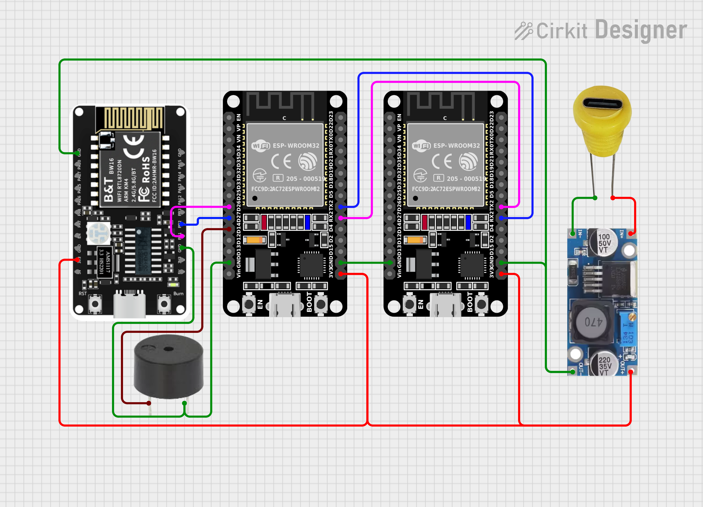

# Coming Soon...

🌐 [https://bijiq.net](https://bijiq.net)  
📺 [Watch the Demo Video](https://youtu.be/CNmAAESZQc0?si=YZMZqPmFLL6IAmBT)

---

## 🔧 For ESP32
===============
| Component     | Address   |
|---------------|-----------|
| BootLoader    | `0x1000`  |
| Partition     | `0x8000`  |
| Firmware      | `0x10000` |
| SPIFFS        | `0x290000` |

---

## 🔧 For BW16
==============
Use the following commands:

bw16.bat erase COM5 (Change COM5 with your COM Port)

bw16.bat flash COM5 (Change COM5 with your COM Port)

Registration Code
=================
Send me the MAC address of the ESP32 and BW16 devices to my email (bijiq.online@gmail.com) I will reply with the registration code.

Thanks

## Circuit Diagrams
===================

